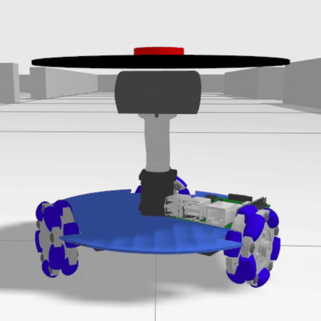
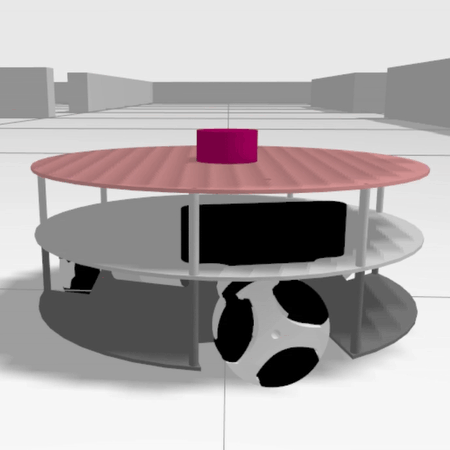
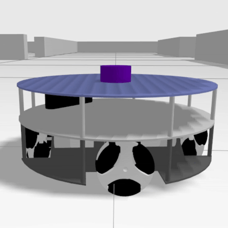

<!--
Copyright 2026 Intelligent Robotics Lab
SPDX-License-Identifier: Apache-2.0
-->

# EasyNav Omni Playground: description

The three- to six-wheel omnidirectional robots used by the EasyNav playgrounds: URDF, meshes and ros2_control controllers. It depends neither on Gazebo nor on EasyNav: `easynav_playground_omni_worlds` simulates them, and `easynav_playground_omni` navigates with them.

## Robots

| `3w` | `3w_v2` (default) | `4w` | `5w` | `6w` |
| --- | --- | --- | --- | --- |
|  |  |  |  |  |

## Build

From the ROS 2 workspace root:

```bash
rosdep install --from-paths src --ignore-src -r -y
colcon build --symlink-install --packages-up-to easynav_playground_omni_description
source install/setup.bash
```

To get the URDF of a robot (`3w`, `3w_v2`, `4w`, `5w`, `6w`):

```bash
xacro $(ros2 pkg prefix easynav_playground_omni_description)/share/easynav_playground_omni_description/urdf/3w_v2/main.urdf.xacro
```

## Package layout

| Directory | Contents |
| --- | --- |
| `urdf/<robot>/` | Each robot's model (`main.urdf.xacro`) |
| `meshes/<robot>/` | Its meshes |
| `config/controller_configs/` | ros2_control controllers of each robot |

## Authors and licensing

The robots are [Yohan Prakoso](https://github.com/YePeOn7/ros2_omni_robot_sim)'s: Copyright (c) 2025 Yohan Prakoso, under the MIT license; see [LICENSE](./LICENSE). Their paths were adapted to this package by Francisco Martín Rico at the [Intelligent Robotics Lab](https://intelligentroboticslab.gsyc.urjc.es/) (Universidad Rey Juan Carlos).
